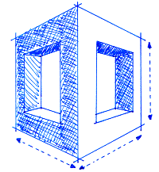

# StackFormation

**Lightweight AWS CloudFormation Stack, Template and Parameter Manager and Preprocessor**

If you want to use StackFormation, please have a look at the [StackFormation documentation](http://stackformation.readthedocs.org)

**License**

[Open Software License v. 3.0 (OSL-3.0)](https://github.com/AOEpeople/StackFormation/blob/master/LICENSE.md)
   
