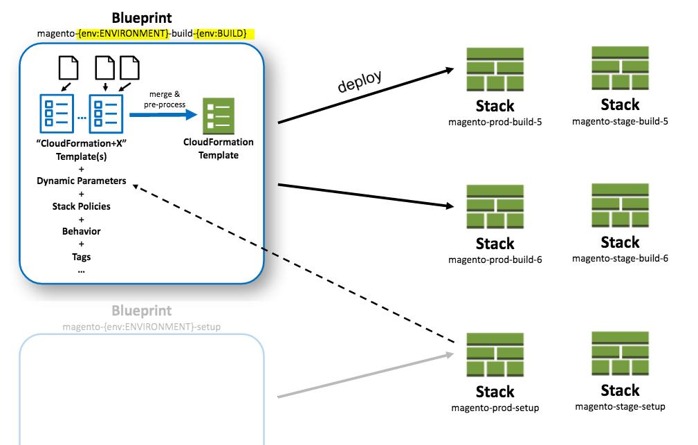

**********
Blueprints
**********

Structuring your blueprints
===========================

Structure your blueprints including all templates and other files (e.g. userdata) in "modules". StackFormation will load all stack.yml files from following locations: 

- ``blueprints/*/*/*/blueprints.yml``
- ``blueprints/*/*/blueprints.yml``
- ``blueprints/*/blueprints.yml``
- ``blueprints/blueprints.yml``
- ``blueprints.yml``

So it's suggested to create a directory structure like this one:

.. code-block:: yaml

    blueprints/
      stack1/
        userdata/
          provisioning.sh
        blueprints.yml
        my.template
      stack2/
        blueprints.yml
      ...

All ``blueprints.yml`` files will be merged together.

Parameters
==========

Adding parameters
-----------------

Add parameters in your ``my-stack.template``:

.. code-block:: json

    {
      "AWSTemplateFormatVersion": "2010-09-09",
      "Parameters: {
        "MyParameter1": { "Type": "String" }
      },
      "Resources": { 
        "MyResource1": { "Type": "AWS::CloudFormation::WaitConditionHandle" }
      }
    }

... and configure that parameter in the ``blueprint.yml`` file:

.. code-block:: yaml

    blueprints:
      - stackname: my-stack
        template: my-stack.template
        parameters:
          MyParameter1: 'Hello World'
          
Parameter values
----------------

+-------------------------------+---------------------------------------------+--------------------------------------------------------------------------------------------------------------------+
| Parameter                     | Syntax                                      | Result                                                                                                             |
+===============================+=============================================+====================================================================================================================+
| Output lookup                 | ``{output:<stack>:<output>}``               | Output value                                                                                                       |
+-------------------------------+---------------------------------------------+--------------------------------------------------------------------------------------------------------------------+
| Resource lookup               | ``{resource:<stack>:<logicalResource>}``    | Physical Id of that resource                                                                                       |
+-------------------------------+---------------------------------------------+--------------------------------------------------------------------------------------------------------------------+
| Parameter lookup              | ``{parameter:<stack>:<logicalResource>}``   | Parameter value (note that some parameters will not be shown if they're 'no\_echo')                                |
+-------------------------------+---------------------------------------------+--------------------------------------------------------------------------------------------------------------------+
| Env var lookup                | ``{env:<var>}``                             | Value of environment variable ``var``                                                                              |
+-------------------------------+---------------------------------------------+--------------------------------------------------------------------------------------------------------------------+
| Env var lookup with  fallback | ``{env:<var>:<defaultValue>}``              | Value of environment variable ``var`` falling back to ``defaultValue`` if env var is not set                       |
+-------------------------------+---------------------------------------------+--------------------------------------------------------------------------------------------------------------------+
| Stack/global variable lookup  | ``{var:<var>}``                             | Value variable ``var``                                                                                             |
+-------------------------------+---------------------------------------------+--------------------------------------------------------------------------------------------------------------------+
| Current timestamp             | ``{tstamp}``                                | e.g. ``1453151115``                                                                                                |
+-------------------------------+---------------------------------------------+--------------------------------------------------------------------------------------------------------------------+
| MD5 sum                       | ``{md5:<filename>}``                        | e.g. ``fdd747e9989440289dcfb476c75b4268``                                                                          |
+-------------------------------+---------------------------------------------+--------------------------------------------------------------------------------------------------------------------+
| Clean                         | ``{clean:2.1.7}``                           | ``217`` removes all characters that arent allowed in stack names                                                   |
+-------------------------------+---------------------------------------------+--------------------------------------------------------------------------------------------------------------------+
| Switch profile                | ``[profile:<profileName>:...]``             | Will switch to a different profile and evaluate the second parameter there. This is useful in cross account setups |
+-------------------------------+---------------------------------------------+--------------------------------------------------------------------------------------------------------------------+

Output and resource lookup allow you to "connect" stacks to each other by wiring the output or resources created in one stack to the input parameters needed in another stack that sits on top of the first one without manually managing the input values.

Example

.. code-block:: yaml
  :emphasize-lines: 8,9

    blueprints:
      - stackname: stack1-db
        template: templates/stack1.template
        [...]
      - stackname: stack2-app
        template: templates/stack2.template
        parameters:
          build: 's3://{output:stack1:bucketName}/{env:BUILD}/build.tar.gz'
          db: '{output:stack1-db:DatabaseRds}'

Variables (global/local, nested into other placeholders)

.. code-block:: yaml
  :emphasize-lines: 9,10
  
    vars:
      KeyPair: 'mykeypair'
        
    blueprints:
      - stackname: mystack
        vars:
          ParentStack: 'MyParentStack'
        parameters:
          KeyPair: '{var:mykeypair}'
          Database: '{output:{var:ParentStack}:DatabaseRds}'
        [...]

Switch Profile Example (in this example an AMI is baked in a different account and shared with this account)

.. code-block:: yaml
  :emphasize-lines: 4
  
    blueprints:
      - stackname: mystack
        parameters:
          BaseAmi: '[profile:myDevAccountProfile:{output:bakestack:BaseAmi}]'

Conditional parameter values
----------------------------

You might end up deploying the same stacks to multiple environments or accounts. Instead of duplicating the blueprints (or using YAML reference) you'll probably want to parameterize your blueprints like this

.. code-block:: yaml
  :emphasize-lines: 2
  
    blueprints:
      - stackname: 'app-{env:Environment}-build'
        template: 'build.template'
        parameters:
          KeyPair: 'MyKeyPair'
        [...]

... and then before deploying (locally or from your CI server) you'd set the env var first and then deploy:

.. code-block:: shell

    $ export Environment=prod
    $ vendor/bin/stackformation.php blueprint:deploy 'app-{env:Environment}-build'

But in many cases those stacks do have some minor differences in some of the parameters (e.g. different VPCs or KeyNames,...) You could solve it like this with nested placeholders:

.. code-block:: yaml
  :emphasize-lines: 5,6,8
  
    blueprints:
      - stackname: 'app-{env:Environment}-build'
        template: 'build.template'
        vars:
          prod-KeyName: MyProdKey
          stage-KeyName: MyStageKey
        parameters:
          KeyPair: '{var:{env:Environment}-KeyName}'

While this is perfectly possible this gets very confusing soon. Plus you'll have to mention every variation of the variable explicitely.

Instead you can use a conditional value:

.. code-block:: yaml
  :emphasize-lines: 6,7,8,9
  
    blueprints:
      - stackname: 'app-{env:Environment}-build'
        template: 'build.template'
        parameters:
          KeyPair: 
            '{env:Environment}==prod': MyProdKey
            '{env:Environment}==stage': MyStageKey
            '{env:Environment}~=/^dev[0-9]+$/': MyDevKey
            'default': MyDevKey

StackFormation will evaluate all keys from top to bottom and the first key that evaluates to true will be returned. Allowed conditions: - ``A==B`` - ``A!=B`` - ``A~=/^regex$/`` - 'default' (will always evaluate to true. Make sure you put this at the very end since everything after this will be ignored). Placeholders will be resolved before the conditions are evaluated.

Wildcards
=========

When referencing a stack in ``{output:<stack>:<output>}``, ``{resource:<stack>:<logicalResource>}``, or ``{parameter:<stack>:<logicalResource>}`` you can use a wildcard to specify a stack. In this case StackFormation looks up all live stacks and finds a stack matching the pattern. If there's no stack or more than a single stack matching the pattern StackFormation will throw an exception. This feature is helpful when you know there's always only a single stack of one type that has a placeholder in it's stackname:

Example: Stackname: ``deployment-{env:BUILD_NUMBER}`` In blueprints.yml:

.. code-block:: yaml
  :emphasize-lines: 4
  
    blueprints:
      - stackname: mystack
        parameters:
          Elb: '{output:deployment-*:Elb}'
          
Effective stackname
===================

You can include environment variable in your stackname (which is very handy for automation via Jenkins). In this case your effective stackname (e.g. ``build-5``) will be different from the configured stackname (e.g. ``build-{env:BUILD_NUMBER}``)

Example

.. code-block:: yaml
  :emphasize-lines: 2

    blueprints:
      - stackname: 'build-{env:BUILD_NUMBER}'
        template: templates/deploy_build.template
        
Reverse blueprint match
=======================

Let's say you have a blueprint ``ecom-{env:ACCOUNT}-{env:ENVIRONMENT}-static-stack`` and you want to deploy it with ACCOUNT=t and ENVIRONMENT=dpl. You would do this by setting the env vars ACCOUNT and ENVIRONMENT and then run the deploy command:

.. code-block:: shell

    $ export ACCOUNT=t
    $ export ENVIRONMENT=dpl
    $ vendor/bin/stackformation.php deploy 'ecom-{env:ACCOUNT}-{env:ENVIRONMENT}-static-stack'

But instead you can also simply run the deploy command with the resulting stack name ``ecom-t-tst-static-stack`` StackFormation will then attempt to find a matching tag, determine which environments need to be set and run the original blueprint for you:

.. code-block:: shell

    $ vendor/bin/stackformation.php deploy 'ecom-t-tst-static-stack'
    
    Blueprint reverse match found: ecom-{env:ACCOUNT}-{env:ENVIRONMENT}-static-stack
    With ENV vars: ACCOUNT=t; ENVIRONMENT=tst
    Use this blueprint and set env vars? [y/N] y
    Setting env var: ACCOUNT=t
    Setting env var: ENVIRONMENT=tst
    ...
