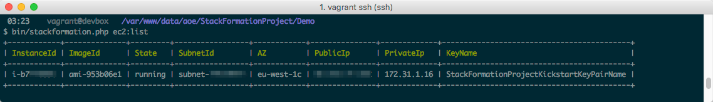

***************
Getting Started
***************

Installation/Usage
==================

Via composer
------------

`Install composer <https://getcomposer.org/doc/00-intro.md#installation-linux-unix-osx>`__ first, then:

.. code-block:: shell

    $ composer require aoepeople/stackformation

Via docker
----------

.. code-block:: shell
    $ docker run --rm -it -v $(pwd):/app -w /app kj187/stackformation:latest <COMMAND>

Example
.. code-block:: shell
    $ docker run --rm -it -v $(pwd):/app -w /app kj187/stackformation:latest setup
    $ docker run --rm -it -v $(pwd):/app -w /app kj187/stackformation:latest blueprint:deploy

Or if you use lambda with golang for instance

.. code-block:: shell
    $ docker run --rm -it -v $(pwd):/app -w /app kj187/stackformation:latest-golang <COMMAND>

For more details, see https://hub.docker.com/r/kj187/stackformation/

Using the phar
--------------

Grab the latest release from https://github.com/AOEpeople/StackFormation/releases/latest or use this shortcut (requires ``jq`` to be installed)

.. code-block:: shell

    $ wget $(curl -s https://api.github.com/repos/AOEpeople/StackFormation/releases/latest | jq -r '.assets[0].browser_download_url')

.. tip::
    If you want to use StackFormation globally:

    .. code-block:: shell

        $ mv stackformation.phar /usr/local/bin/stackformation
        $ chmod +x /usr/local/bin/stackformation
        
        
Quickstart
==========

AWS access keys
---------------

Execute the setup command to add all necessary AWS env vars

.. code-block:: shell

    $ vendor/bin/stackformation.php setup
    
Add it to your gitignore: ``echo .env.default >> .gitignore``
    
Create a blueprint
------------------

Create a ``blueprints.yml`` in your project directory:

.. code-block:: yaml

    blueprints:
      - stackname: my-stack
        template: my-stack.template

Create a CloudFormation template
--------------------------------

Create a CloudFormation template ``my-stack.template`` in your project directory:

.. code-block:: json

    {
      "AWSTemplateFormatVersion": "2010-09-09",
      "Resources": { 
        "MyResource1": { "Type": "AWS::CloudFormation::WaitConditionHandle" }
      }
    }

Deploy your stack
-----------------

.. code-block:: shell

    $ bin/stackformation.php deploy my-stack

Kickstart a project
===================

Imagine we are starting from scratch, on a so called green field.

.. code-block:: shell

    $ mkdir DemoProject
    $ cd DemoProject

Installation
------------

First of all, we have to install StackFormation, for this demo we will da that via composer

.. code-block:: shell

    $ composer require aoepeople/stackformation

Your first level project structure should be looking like that now

.. code-block:: text

    ├── composer.json
    ├── composer.lock
    └── vendor

To check if StackFormation is working properly execute the following command

.. code-block:: shell

    $ vendor/bin/stackformation.php

You should see all available StackFormation commands and options now.

Required environment settings
-----------------------------

Execute the setup command to add all necessary AWS env vars

.. code-block:: shell

    $ vendor/bin/stackformation.php setup
    
Add it to your gitignore: ``echo .env.default >> .gitignore``

Short check
-----------

If your access and secret key are correct and the user behind that have enough permissions, you are now able to use the whole magic of StackFormation. Just a quick example, you want to know what and how many ec2 instances are currently running?

.. code-block:: shell

    $ vendor/bin/stackformation.php ec2:list

Your first blueprint
--------------------

Create a ``blueprints.yml`` in your current directory:

.. code-block:: yaml

    blueprints:
      - stackname: my-stack
        template: my-stack.template

Create you CloudFormation template ``my-stack.template``:

.. code-block:: json

    {
      "AWSTemplateFormatVersion": "2010-09-09",
      "Resources": {
        "MyResource1": { "Type": "AWS::CloudFormation::WaitConditionHandle" }
      }
    }

Deploy your stack
-----------------

.. code-block:: shell

    $ vendor/bin/stackformation.php deploy my-stack

The output should be the following

.. code-block:: shell

    $ vendor/bin/stackformation.php stack:list

