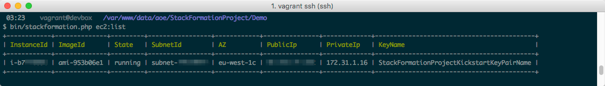

**********
Greenfield
**********

Imagine we are starting from scratch, on a so called green field.

.. code-block:: shell

    $ mkdir DemoProject
    $ cd DemoProject

Installation
============

Now we have to install StackFormation, for this demo we will install it via composer

.. code-block:: shell

    $ composer require aoepeople/stackformation

Your first level project structure should be looking like that now

.. code-block:: text

    ├── composer.json
    ├── composer.lock
    └── vendor

To check if StackFormation is working properly execute the following command

.. code-block:: shell

    $ vendor/bin/stackformation.php

You should see all available StackFormation commands and options now. 

Required environment settings 
=============================

Now create a ``.env.default`` file (and add it yo your gitignore: ``echo .env.default >> .gitignore``)

.. code-block:: text

    AWS_ACCESS_KEY_ID=INSERT_YOUR_ACCESS_KEY_HERE
    AWS_SECRET_ACCESS_KEY=INSERT_YOUR_SECRET_KEY_HERE
    AWS_DEFAULT_REGION=INSERT_YOUR_DEFAULT_REGION_HERE

Short check
===========

If your access and secret key are correct and the user behind that have enough permissions, you are now able to use the whole magic of StackFormation. Just a quick example, you want to know what and how many ec2 instances are currently running?

.. code-block:: shell

    $ vendor/bin/stackformation.php ec2:list

Your first blueprint
====================

Create a ``blueprints.yml`` in your current directory:

.. code-block:: yaml

    blueprints:
      - stackname: my-stack
        template: my-stack.template

Create you CloudFormation template ``my-stack.template``:

.. code-block:: json

    {
      "AWSTemplateFormatVersion": "2010-09-09",
      "Resources": { 
        "MyResource1": { "Type": "AWS::CloudFormation::WaitConditionHandle" }
      }
    }

Deploy your stack
=================

.. code-block:: shell

    $ vendor/bin/stackformation.php deploy my-stack

The output should be the following

.. image:: Images/kickstart_demo_deploy.png

.. code-block:: shell

    $ vendor/bin/stackformation.php stack:list

.. image:: Images/kickstart_demo_stacklist.png