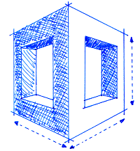

######################################
StackFormation |version| Documentation
######################################

|Build Status| |Code Climate| |Test Coverage|

**Lightweight AWS CloudFormation Stack, Template and Parameter Manager and Preprocessor**

Deploying CloudFormation stacks to AWS can be done using the AWS Console, AWS Cli or any SDK. While this is perfectly ok it can be a challenge to keep track of what template is used for what stack and manage the input parameters.
This is where "StackFormation" comes in.

StackFormation (note the wordplay: CloudFormation / Stacks) will read a stacks.yml file that contains information about stacks, the templates they use and their input parameters. It also allows you to query values for input parameters from other stack's resources or outputs.
In addition to that StackFormation makes it easy to embed scripts into UserData.

This version of the documentation covering StackFormation |release| has been rendered at: |today|

.. toctree::
   :maxdepth: 3
   :caption: StackFormation Documentation

   GettingStarted/index
   Blueprints/index
   Templates/index
   StackReferences/index
   UserData/index
   StackPolicies/index
   ShellCommands/index
   
.. |Build Status| image:: https://travis-ci.org/AOEpeople/StackFormation.svg?branch=master
   :target: https://travis-ci.org/AOEpeople/StackFormation
.. |Code Climate| image:: https://codeclimate.com/github/AOEpeople/StackFormation/badges/gpa.svg
   :target: https://codeclimate.com/github/AOEpeople/StackFormation
.. |Test Coverage| image:: https://codeclimate.com/github/AOEpeople/StackFormation/badges/coverage.svg
   :target: https://codeclimate.com/github/AOEpeople/StackFormation/coverage